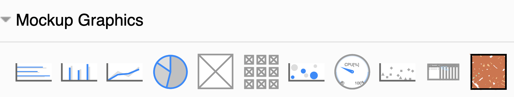
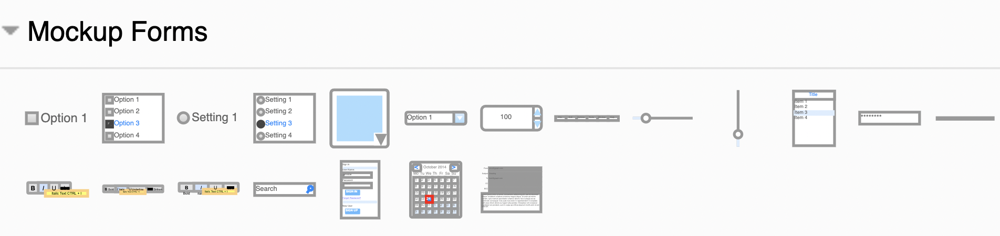
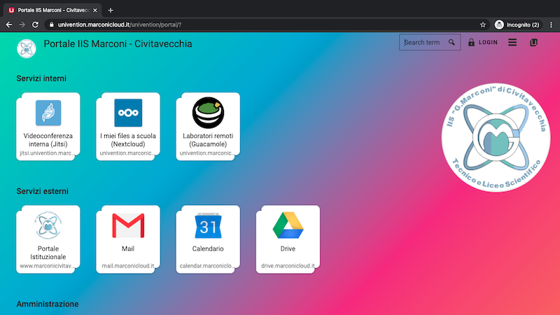

# Wireframe

Prima di cominciare a sviluppare una pagina web, dobbiamo avere chiaro come deve essere fatta, e a questo fine è importante disegnare una bozza su carta o con qualche software specifico.

Questo è utile per una serie di ragioni:
- ci concentriamo solo su come deve essere fatta la pagina, senza distrarci con i problemi di implementazione
- rimane come riferimento durante lo sviluppo
- può essere mostrato ad altre persone per avere un confronto

Fare una pagina web senza prima una bozza è come costruire una casa senza prima avere una piantina, cominciando direttamente a tirare su i muri. Le probabilità che il risultato finale sia lontano da quello desiderato sono praticamente del 100%.

Durante la prima fase di bozza, dobbiamo concentrarci solo sugli elementi che vogliamo visualizzare, la loro disposizione nella pagina e nella descrizione del comportamento voluto. Non vogliamo distrarci con la scelta dei colori, font ed altre cose che entreranno in gioco in un momento successivo.

Questo tipo di progettazione solo concettuale si chiama "wireframe" (si può tradurre con "modello in fil di ferro"), perché generalmente rappresenta gli oggetti in modo stilizzato solo con il loro bordo esterno, come fossero fatti con il fil di ferro, appunto.

Anche se il bozzetto su carta è una valida opzione, quando si lavora in modo un po' strutturato è bene avere una versione digitale del wireframe. Esistono molti programmi a questo scopo, a vari livelli, qui ne cito alcuni dei più comuni:
- wireframe.cc, solo per i wireframe, interamente online, versione base gratuita
- [balsamiq](https://balsamiq.com/), disponibile online e offline, valida alternativa
- [sketch.com](https://www.sketch.com/), uno dei tool più professionali e completi, ha anche una versione gratuita di prova
- [draw.io](https://www.diagrams.net/), open source e interamente gratuito con funzioni anche avanzate di disegno, per vari settori

Noi useremo draw.io che per il contesto scolastico e personale abbiamo trovato essere il più adatto.

## Draw.io
Draw.io (disponibile anche su [diagrams.net](https://www.diagrams.net/about.html)), è un servizio che offre uno strumento gratuito ed open-source, estensibile ed adatto a vari contesti, dai diagramma UML, agli schemi di rete, ai wireframe web. La sua diffusione ed il fatto di essere open-source ha fatto in modo che esistano moltissimi plugin di integrazione con tanti altri servizi, come ad esempio [VSCode](https://www.diagrams.net/blog/embed-diagrams-vscode).

> Come altri servizi open-source, il salvataggio dei dati avviene o
> salvando un file sul computer dell'utente o con servizi di storage di
> terze parti, come ad esempio Google Drive  o GitHub. Questo
> essenzialmente per due motivi:
> - lo storage dei file è una delle parti più costose di un progetto web, spesso i progetto open-source non possono permetterselo
> - evitare problemi di privacy
> - evitare problemi di perdita dati con relative possibili conseguenze legali o di immagine

Andando sul sito di draw.io per la prima volta, vi chiederà dove salvare i vostri file. Per ora potete premere in basso "decide later".

Per poter usare gli strumenti di wireframe per il web, dovete aggiungere un po' di forme. Cliccate in basso a sinistra su "More shapes...", quindi selezionate "Android", "iOS" e "Mockups".

Bene, ora siete pronti per sviluppare!

## Elementi di un wireframe
Gli elementi del wireframe sono standardizzati e servono per far capire che tipo di elemento deve andare in un certo punto.

Ad esempio, se vogliamo mettere delle immagini potremmo scegliere uno dei seguenti elementi:

I primi 4 rappresentano dei grafici, l'ultimo rappresenta una mappa, e così via. Il quadrato con la X (detto anche "box", scatola) rappresenta convenzionalmente un'immagine generica.

Per gli elementi di interazione, c'è la categoria "forms":

Questi elementi coprono praticamente tutti i tipi di interazione che si hanno con le pagine web: checkbox, radio button, menu a tendina, selettori, slider, barra di ricerca, calendario, casella di input, etc.

Per avere il contenitore dove mettere i vari elementi, possiamo scegliere:
- se vogliamo una pagina web da browser, andiamo su Mockup Containers->Browser Window
- se vogliamo una pagina web in un dispositivo mobile, andiamo nelle categorie "Android" oppure "iOS UI" e selezioniamo il mockup desiderato

### Ingombri
Selezionare il corretto contenitore per la pagine web è importante perché bisogna fare molta attenzione agli "ingombri" quando disegnate il wireframe: lo spazio occupato sulla pagina da un certo elemento deve corrispondere a quello nella pagina finale.

Questo è importante perché così posso capire quante cose riescono ad entrare all'interno della pagina e quante ne rimangono fuori, in modo da poter togliere o cambiare alcuni elementi grafici per fare in modo che la pagina sia facilmente fruibile, soprattutto in ambiente mobile in cui gli schermi sono più piccoli.

## Flusso di lavoro
Il flusso di lavoro per lo sviluppo di una pagina web è quindi il seguente:

1. brief
2. wireframe
3. visual
4. implementazione html

Il visual è la versione del wireframe con tutti i colori e le immagini al loro posto. Si può sviluppare o con lo stesso software di wireframe, se lo permette (draw.io non lo permette, ma ad esempio Sketch sì), oppure con strumenti tipo Photoshop e simili. L'output del visual è qualcosa che assomiglia molto ad uno screenshot di come dovrà apparire la pagina.

Noi la fase visual la salteremo perché richiederebbe troppo tempo e delle competenze grafiche che normalmente non sono richieste agli studenti del tecnico. In ogni caso gli appassionati possono provare ad inserire anche questa fase!

## Esempio: marconicloud.it

Proviamo adesso a fare un esempio pratico.

Come abbiamo detto, normalmente dovremmo prima disegnare il wireframe e poi da lì il visual ed implementare la pagina. Ma per esercizio, proviamo a fare l'operazione inversa: da una pagina web esistente, tiriamo fuori il wireframe che potrebbe averlo preceduto.

Prendiamo la pagina del portale interno del marconi:

Il wireframe potrebbe essere:
<iframe frameborder="0" style="width:100%;height:533px;" src="https://viewer.diagrams.net/?highlight=0000ff&nav=1&title=Primo%20diagramma.drawio#Uhttps%3A%2F%2Fraw.githubusercontent.com%2Fwbigger%2F2021-informatica-html5%2Fmain%2FPrimo%2520diagramma.drawio"></iframe>

Analizziamo alcune cose significative:
- le immagini sono state tutte sostituite con dei box
- ci sono delle note per specificare alcune immagini significative
- le icone di ricerca, per il login e per il menù sono state scelte dalla libreria di draw.io
- i testi che compaiono nel wireframe sono quelli reali della pagina
- gli ingombri sono rispettati
- non c'è l'immagine con il logo sullo sfondo perché non è qualcosa che ci interessa rappresentare, non ci si può interagire e lo consideriamo parte integrante dello sfondo

Come vedete, creare un wireframe di questo genere può richiedere pochi minuti, ma riduce moltissimo i tempi successivi di sviluppo perché permette di fissare le idee, chiedere consiglio ad altri e fare modifiche al progetto in modo veloce.
<!--stackedit_data:
eyJoaXN0b3J5IjpbLTE4Mzk1MTQ5ODEsLTEzNDY2MTI3ODksLT
E3MTEyNjk0MzQsMjA5NjgwNTM5NCwxOTYzMjg1ODQ2LDIzNjQ1
ODcyOSwtMjA2MDY3NzYxN119
-->